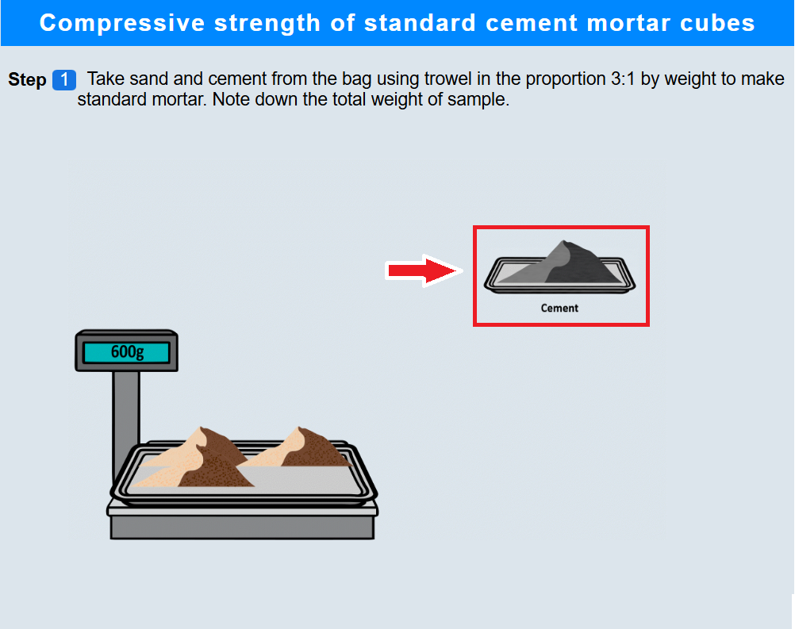
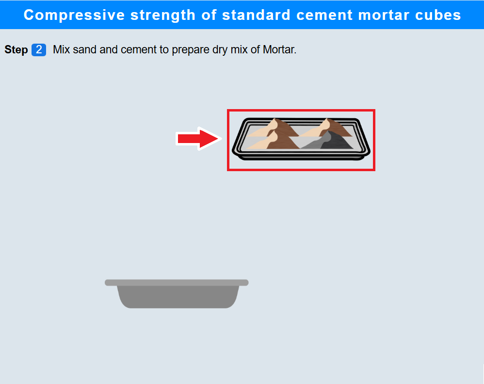
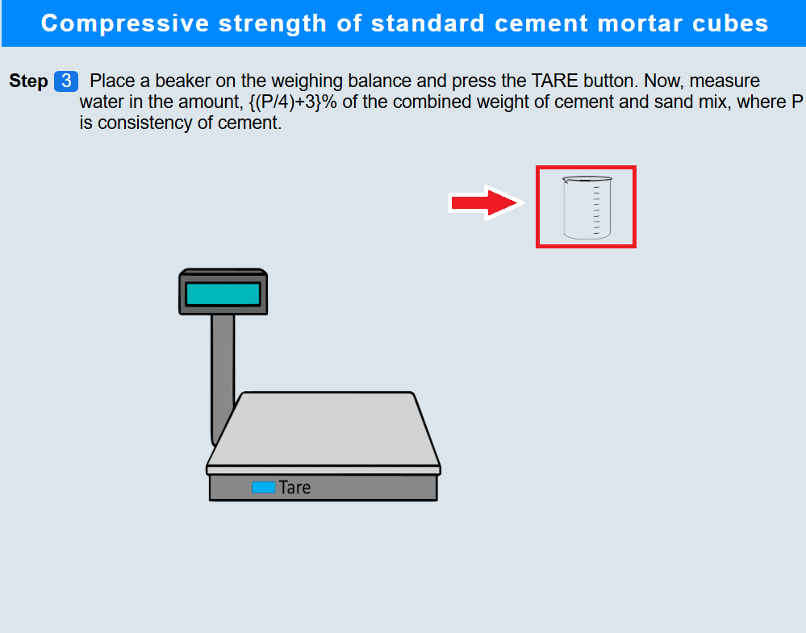
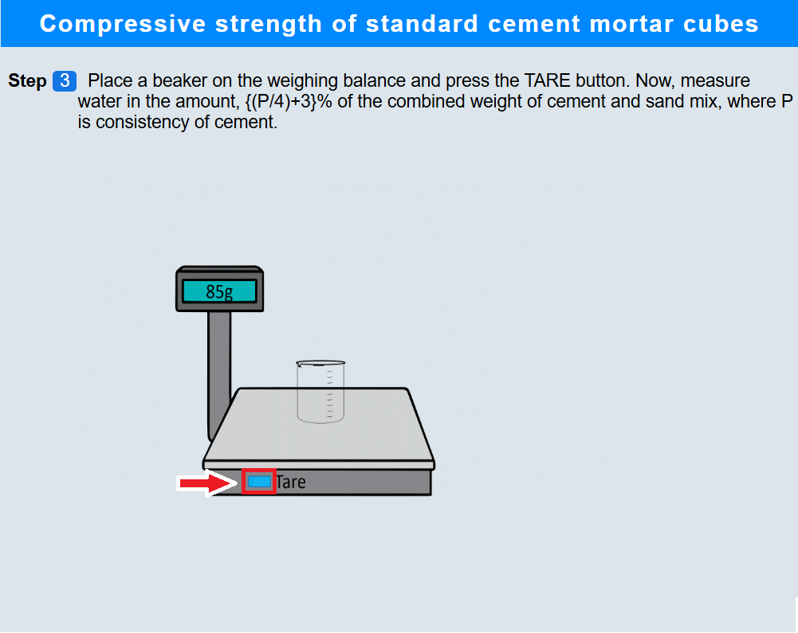
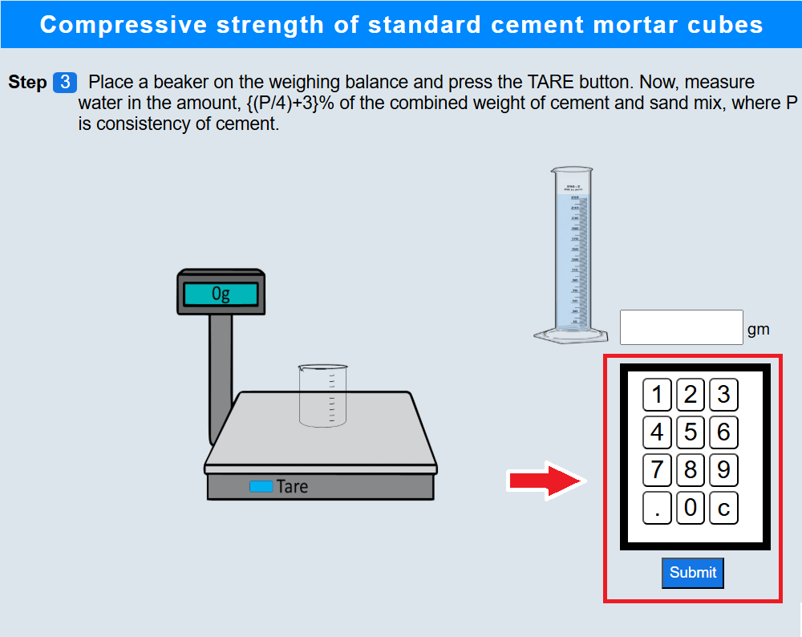
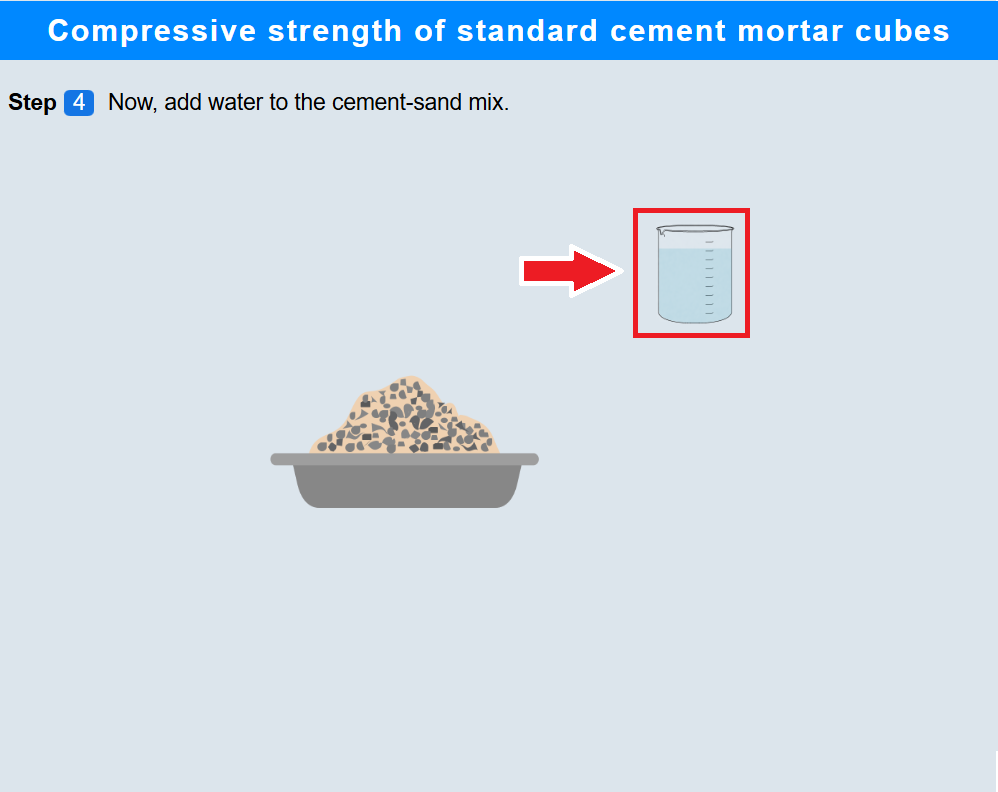
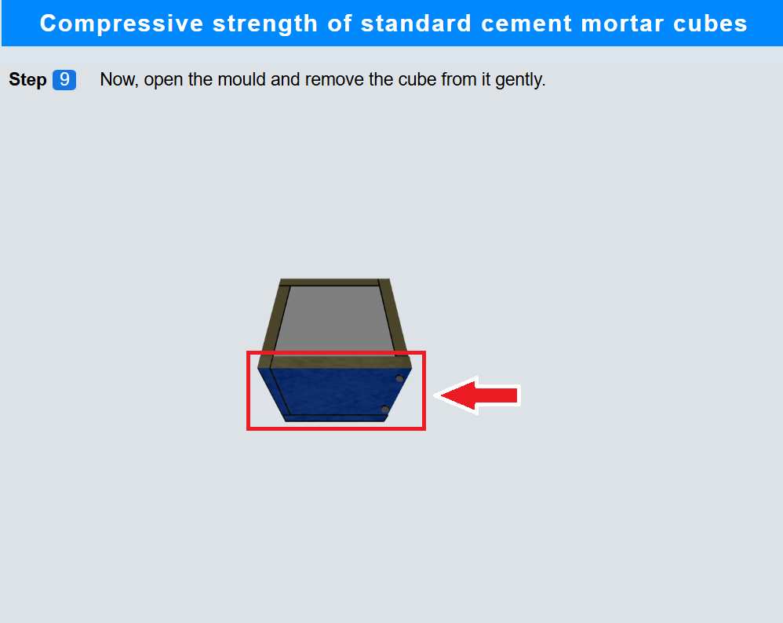
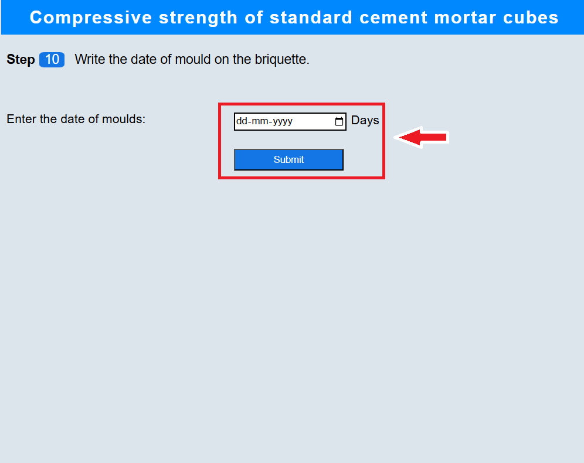
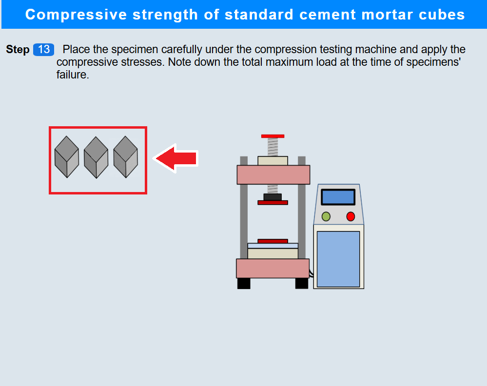
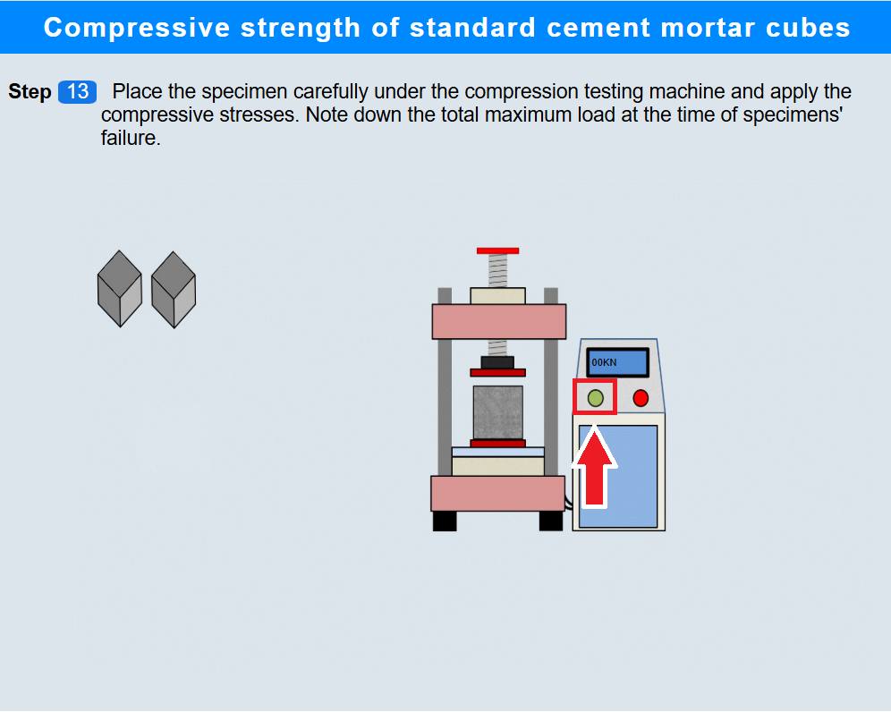

#### **1. Weighing of the sample**

• Click on trays containing sand to measure 3 part of sand sample.

 

• Click on tray containing cement to measure 1 part of cement sample.

 

#### **2. Transferring the sample**

• Click on the tray containing sand and cement samples to transfer the material into the tub.

 

#### **3. Measuring the water**

• Click on the empty beaker to put it on the weighing balance.

 

• Click on tare button to tare the weighing balance.

 

• Click on the measuring cylinder and enter appropriate value of the amount of water to be added.

 

#### **4. Mixing the water**

• Click on the beaker to add water to the cement-sand sample and mix it.

 

#### **5. Pouring the mortar into the moulds**

• Click on the trowel to pour the mortar in the cube.

 

#### **6. Compacting the mortar**

• Click on the rammer to compact the mortar mix in the mould.

 

#### **7. Pouring the mortar into the moulds**

• Again, click on the trowel to pour the mortar in the cube mould.

 

#### **8. Compacting the mortar**

• Click on the rammer to compact it and obtain a smooth finish.

 

#### **9. Opening the mould**

• Click on the mould to open it and remove the cube

 

#### **10. Writing the experiment date on the cubes**

• Select the date of test to write it on the cubes.

 

#### **11. Submerging the cubes into water tank**

• Click on the cubes one by one to submerge them into the water tank.

 

• Click on the first 3 moulds to take out them after 3 days.

#### **12. Wiping the cubes**

 

• Click on the cloth to wipe them using the cloth.

 

#### **13. Testing the compression strength**

• Click on the cubes to place them on the compression testing machine.

 

• Click on the start button to apply the load and note the maximum load value.

 

• Click on the remaining three mould to take out them from the tank after after 7 days.

 

• Similarly, click on the remaining moulds to place them on the machine.

• Again click on the start button to apply the load and note the maximum load value.